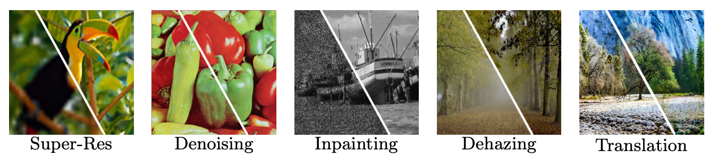

# NAS-DIP: Learning Deep Image Prior with Neural Architecture Search

This repository contains the source code for the paper NAS-DIP: Learning Deep Image Prior with Neural Architecture Search.



## Abstract
Recent work has shown that the structure of deep convolutional neural networks can be used as a structured image prior for solving various inverse image restoration tasks. Instead of using hand-designed architectures, we propose to search for neural architectures that capture stronger image priors. Building upon a generic U-Net architecture, our core contribution lies in designing new search spaces for (1) an upsampling cell and (2) a pattern of cross-scale residual connections. We search for an improved network by leveraging an existing neural architecture search algorithm (using reinforcement learning with a recurrent neural network controller). We validate the effectiveness of our method via a wide variety of applications, including image restoration, dehazing, image-to-image translation, and matrix factorization. Extensive experimental results show that our algorithm performs favorably against state-of-the-art learning-free approaches and reaches competitive performance with existing learning-based methods in some cases.

## Citation
If you find our code useful, please consider citing our work using the following bibtex:
```
@inproceedings{NAS-DIP,
  title={NAS-DIP: Learning Deep Image Prior with Neural Architecture Search},
  author={Chen, Yun-Chun and Gao, Chen and Robb, Esther and Huang, Jia-Bin},
  booktitle={European Conference on Computer Vision (ECCV)},
  year={2020}
}
```

## Acknowledgement
 - This code is heavily borrowed from [Ulyanov et al.](https://github.com/DmitryUlyanov/deep-image-prior)
